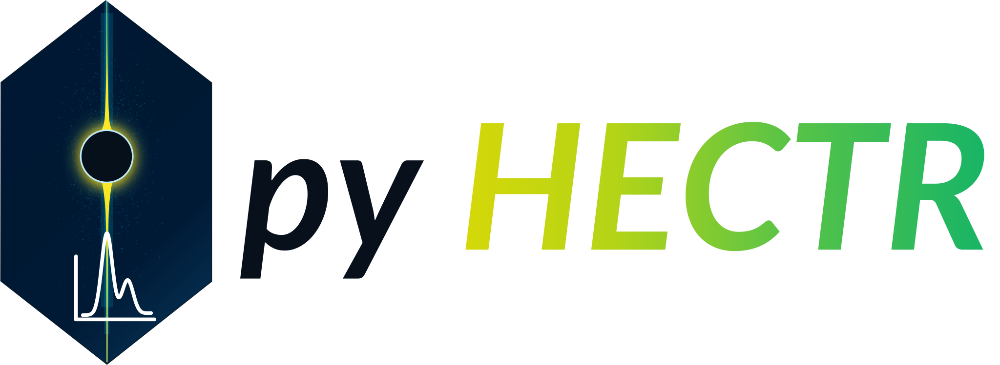

<p align="center">
  
</p>

# pyHECTR

Python tools for high energy crystal truncation rod (CTR) reconstruction, detector space mask preparation, and rocking scan integration.


`pyHECTR` supports the classical data reduction branch used for high energy grazing incidence X-ray diffraction (HEGIXRD) measurements with  two dimensional detectors. The package provides utilities for detector geometry, reciprocal space reconstruction, CTR mask generation, and visualization.

The neural network (CNN) mask inference based on Detectron2 is optional and requires a separate PyTorch/Detectron2 installation that matches your CPU/GPU environment.

---

## Recommended environment setup

Use a fresh virtual environment for `pyHECTR`. This avoids conflicts between scientific Python packages, Jupyter widgets, PyTorch, CUDA, and Detectron2.

```bash
python3 -m venv pyhectr
source pyhectr/bin/activate          # Linux/macOS
# pyhectr\Scripts\activate           # Windows PowerShell

python -m pip install --upgrade pip setuptools wheel
```

For the full tools usage, install the  extras.

```bash
python -m pip install "pyhectr[full]"
```

Register the environment as a Jupyter kernel:
```bash
python -m ipykernel install --user --name pyhectr --display-name "pyHECTR"
```

Then open JupyterLab and select the kernel named **pyHECTR**.

---

## Installation

Python 3.9–3.12 is currently supported.

### Install from PyPI

PyPI:

```bash
python -m pip install pyhectr
```

For optional helper dependencies:

```bash
python -m pip install "pyhectr[full]"
```

### Install directly from GitHub

Install the latest version from the default branch:

```bash
python -m pip install "pyhectr @ git+https://github.com/batradiik/pyHECTR.git"
```

With optional helper dependencies

```bash
python -m pip install "pyhectr[full] @ git+https://github.com/batradiik/pyHECTR.git"
```

---

### Clone for development


```bash
git clone https://github.com/batradiik/pyHECTR.git
cd pyHECTR

python3 -m venv pyhectr
source pyhectr/bin/activate          # Linux/macOS
# pyhectr\Scripts\activate           # Windows PowerShell

python -m pip install --upgrade pip setuptools wheel
python -m pip install -e ".[full,dev]"
python -m ipykernel install --user --name pyhectr-dev --display-name "pyHECTR dev"
```

---


## Documentation 

Documentation is available at:
https://pyhectr.readthedocs.io


---

## Optional Detectron2 installation

The classical CTR reconstruction and rocking scan integration tools do **not** require Detectron2.

Detectron2 is only needed for the optional Mask R-CNN / neural network helpers in `pyhectr.mask_nn`. Detectron2 should be installed manually because it must match your installed PyTorch and CUDA setup.

### 1. Install `pyHECTR` with neural-network helper dependencies

```bash
python -m pip install "pyhectr[full]"
```

For a development checkout:

```bash
python -m pip install -e ".[full,dev]"
```

### 2. Install PyTorch and torchvision

Choose the correct command for your machine from the official PyTorch installation selector:

<https://pytorch.org/get-started/locally/>

CPU only example:

```bash
python -m pip install torch torchvision --index-url https://download.pytorch.org/whl/cpu
```

GPU/CUDA example:

```bash
# Replace the index URL with the CUDA build recommended by the PyTorch selector.
python -m pip install torch torchvision --index-url https://download.pytorch.org/whl/cu121
```

### 3. Install Detectron2

Install Detectron2 after PyTorch is installed:

```bash
python -m pip install "git+https://github.com/facebookresearch/detectron2.git"
```

See the official Detectron2 installation guide for platform-specific notes:

<https://detectron2.readthedocs.io/en/stable/tutorials/install.html>

### 4. Verify the installation

```bash
python - <<'PY'
import torch
import detectron2
from pyhectr import mask_nn

print("torch:", torch.__version__)
print("CUDA available:", torch.cuda.is_available())
print("detectron2:", detectron2.__version__)
print("pyhectr.mask_nn imported successfully")
PY
```

If Detectron2 import fails after changing PyTorch, reinstall Detectron2 in the same environment.

---

## Automated ROD structure search

Automated surface structure fitting for ROD are available in the separate [ROD Optuna Search](https://github.com/batradiik/rod_structure_search) repository.

The repository uses Optuna to select and optimize ROD refinement parameters and provides:

- a local Windows workflow using `rod.exe`;
- a parallel Linux workflow using `rod_doublePrecision` and SLURM;
- example Nb input files for `.bul`, `.fit`, `.par`, and `.dat` workflows;
- restartable searches and storage of the best fitting result files.


---


## Dependencies

### Core dependencies

A standard installation includes:

- NumPy
- SciPy
- Matplotlib
- Pillow
- ImageIO
- ImageIO-FFmpeg
- pandas
- tqdm
- OpenCV headless
- xrayutilities
- JupyterLab
- IPython kernel
- ipympl

### Extras

Installing `pyhectr[full]` additionally provides:

- Numba
- joblib
- scikit-image
- h5py
- hdf5plugin
- yacs
- pycocotools
- fvcore
- iopath

---


## Citation

If you use `pyHECTR` in research, cite the software using the metadata in `CITATION.cff`.

A paper citation will be added as the preferred citation after the associated manuscript has been published and assigned a DOI. For archived software releases, a version specific DOI can also be created through Zenodo.

---


## Contributing

Bug reports and focused pull requests are welcome. Before contributing:

1. open an issue describing the proposed change;
2. add or update tests for behavior changes;
3. update docstrings and documentation where needed;
4. run the test and lint checks locally.


---


## License

This project is distributed under the GNU General Public License v2.0 or later (`GPL-2.0-or-later`). See `LICENSE`.

Parts of the Bragg simulation functionality are adapted from or closely related to `xrayutilities`, which is distributed under `GPL-2.0-or-later`. Preserve the applicable copyright and attribution notices for adapted code.

