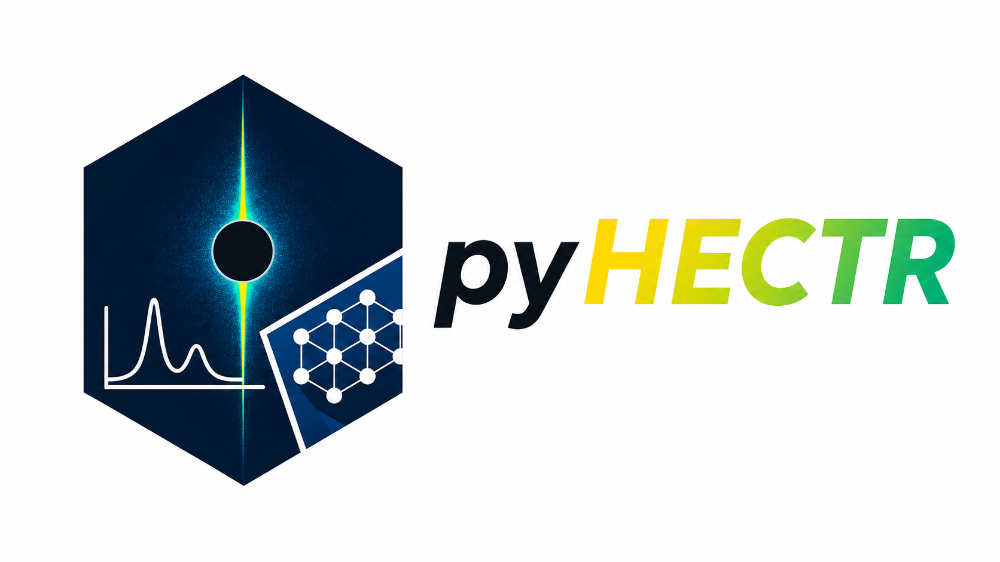

<p align="center">
  
</p>

# pyHECTR

Python tools for high-energy crystal truncation rod (CTR) reconstruction, detector-space mask preparation, and rocking scan integration.


`pyHECTR` supports the classical data reduction branch used for high energy grazing-incidence X-ray diffraction (HEGIXRD) measurements with  two dimensional detectors. The package provides utilities for detector geometry, reciprocal space reconstruction, CTR mask generation, and visualization.


## Installation

Python 3.10 or newer is recommended.

### Install from PyPI

After the first release is published on PyPI:

```bash
python -m pip install pyhectr
```


### Install directly from GitHub

Install the latest version from the default branch:

```bash
python -m pip install "pyhectr @ git+https://github.com/batradiik/pyHECTR.git"
```


### Clone for development

```bash
git clone https://github.com/batradiik/pyHECTR.git
cd pyHECTR

python -m venv .venv
source .venv/bin/activate          # Linux/macOS
# .venv\Scripts\activate           # Windows PowerShell

python -m pip install --upgrade pip
python -m pip install -e .
```

## Documentation 

The documentation for the related package can be find:
https://pyhectr.readthedocs.io


## Package modules

- `pyhectr.xrd_geom`  
  Detector angle conversion, reciprocal space grids, reciprocal-cell and UB matrices, HKL maps, CTR localization, and mask morphology.

- `pyhectr.integration`  
  Background estimation, signal window estimation, correction maps, binary mask preparation, and rocking scan integration.

- `pyhectr.read_plot`  
  DESY P07 image and metadata loading, plotting utilities, interactive sliders, reciprocal-space interpolation, output folder creation, and uncertainty estimates.

- `pyhectr.bragg_simulations`  
  Theoretical reflection handling, reciprocal space peak plotting and azimuthal offset scans.

- `pyhectr.theta0_finder`  
  Conversion of detector pixels to fractional HKL coordinates.


## Dependencies

- NumPy
- SciPy
- Matplotlib
- Pillow
- ImageIO
- OpenCV
- pandas
- tqdm
- xrayutilities
- seaborn
- ipython
- jupyterlab


## Citation

If you use `pyHECTR` in research, cite the software using the metadata in `CITATION.cff`.

A paper citation should be added as the preferred citation after the associated manuscript has been published and assigned a DOI. For archived software releases, a version-specific DOI can also be created through Zenodo.


## Contributing

Bug reports and focused pull requests are welcome. Before contributing:

1. open an issue describing the proposed change;
2. add or update tests for behavior changes;
3. update docstrings and documentation where needed;
4. run the test and lint checks locally.


## License

This project is distributed under the GNU General Public License v2.0 or later (`GPL-2.0-or-later`). See `LICENSE`.

Parts of the Bragg-simulation functionality are adapted from or closely related to `xrayutilities`, which is distributed under `GPL-2.0-or-later`. Preserve the applicable copyright and attribution notices for adapted code.

